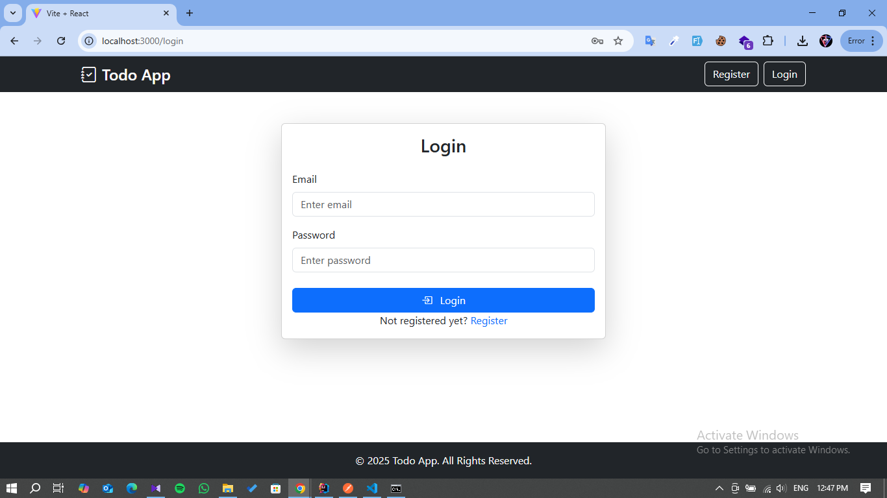
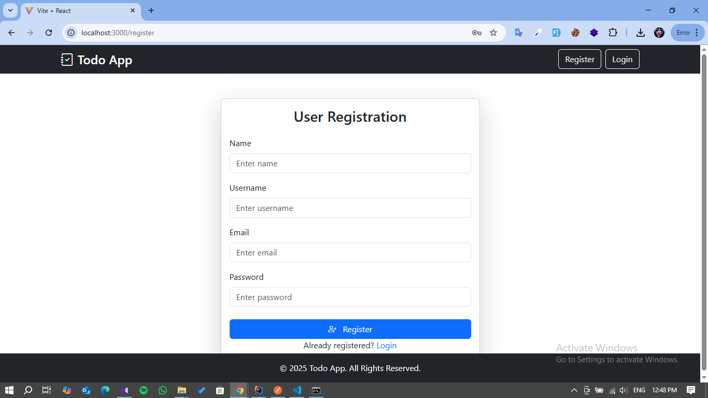
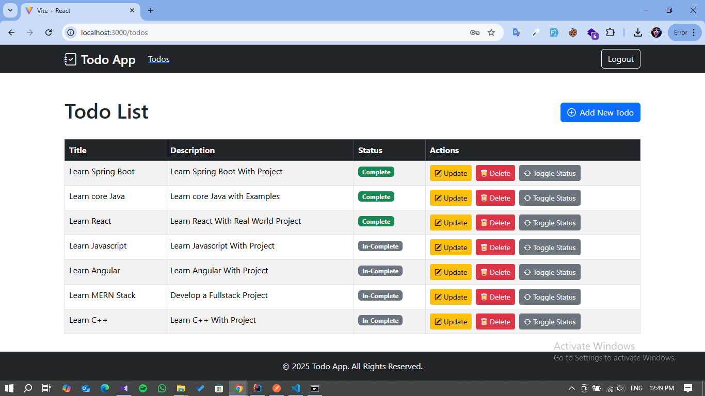
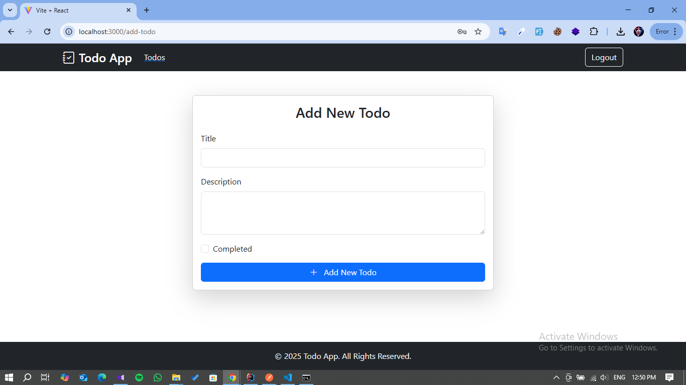
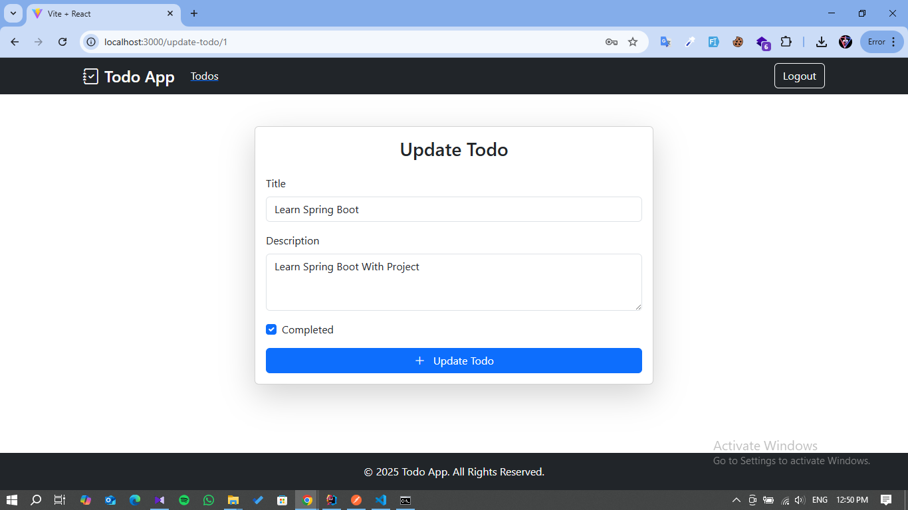

# Todo App - Spring Boot & React (Vite)

A full-stack Todo Application built with **Spring Boot** (Backend API) and **Vite + React** (Frontend). The app features **JWT-based Authentication**, **Role-based Authorization**, and complete **CRUD operations on Todos**. 

---

## 🚀 Tech Stack
- **Backend:** Spring Boot, Spring Security, JWT
- **Frontend:** React, Vite
- **Styling:** Bootstrap 5
- **Authentication:** JSON Web Tokens (JWT)
- **Authorization:** Role-Based Access Control (RBAC)

---

## ✨ Features

### Authentication & Authorization
- User Registration & Login
- JWT Token-based Authentication
- Role-based Authorization
  - **ADMIN**: Can perform all CRUD operations on Todos.
  - **USER**: Can only change the status of Todos (Mark as Done/Pending).

### Todo Management (CRUD)
- Create, View, Update, Delete Todos (Admin Only)
- View Todos (User & Admin)
- Status Update (Users can toggle Todo status)

---

## 📸 Screenshots

### 🔐 Login Page


### 📝 Register Page


### 📋 Todos List Page


### ➕ Add New Todo Page (Admin)


### ✏️ Update Todo Page (Admin)


---

## 📁 Project Structure
```
/todo-app/
  ├── backend/       // Spring Boot Project
  ├── frontend/      // Vite + React Project
  └── README.md
```

---

## 🛠️ How to Run Locally

### Prerequisites:
- Java 17+
- Maven
- Node.js & npm
- MySQL (or H2 in-memory DB for testing)

### Backend (Spring Boot)
```bash
cd backend
mvn spring-boot:run
```
- Backend runs on: `http://localhost:8080`

### Frontend (Vite + React)
```bash
cd frontend
npm install
npm run dev
```
- Frontend runs on: `http://localhost:3000`

---

## 🔒 API Security Flow
- After login, a **JWT token** is returned and stored on the client.
- All protected API routes require JWT in the Authorization Header.
- Role-based Access Controls (RBAC) are enforced on API endpoints.

---

## 🎨 UI Features
- Responsive UI with Bootstrap 5
- Conditional Rendering based on User Roles (USER/ADMIN)
- Login & Registration Forms
- Todo List with Action Buttons (Edit/Delete for Admins, Status Toggle for Users)

---

## 📝 Future Enhancements
- Token Refresh Mechanism
- User Profile Page
- Pagination & Search on Todos
- Deployment (Render/Netlify)

---

## 📚 Author
**Lakshan Kawshalya**  
[LinkedIn](https://www.linkedin.com/in/lakshan-kawshalya) | lakshankauvshalya@gmail.com

---

## 📄 License
This project is open-source and available under the MIT License.
